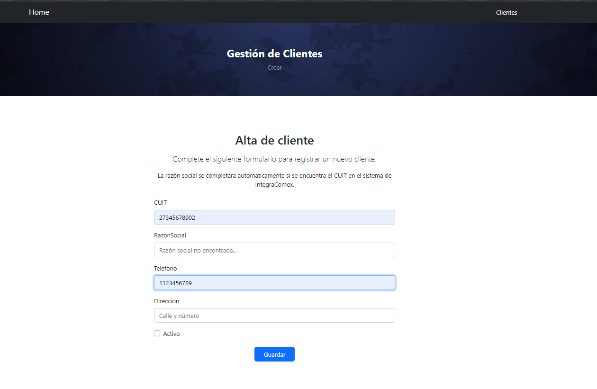
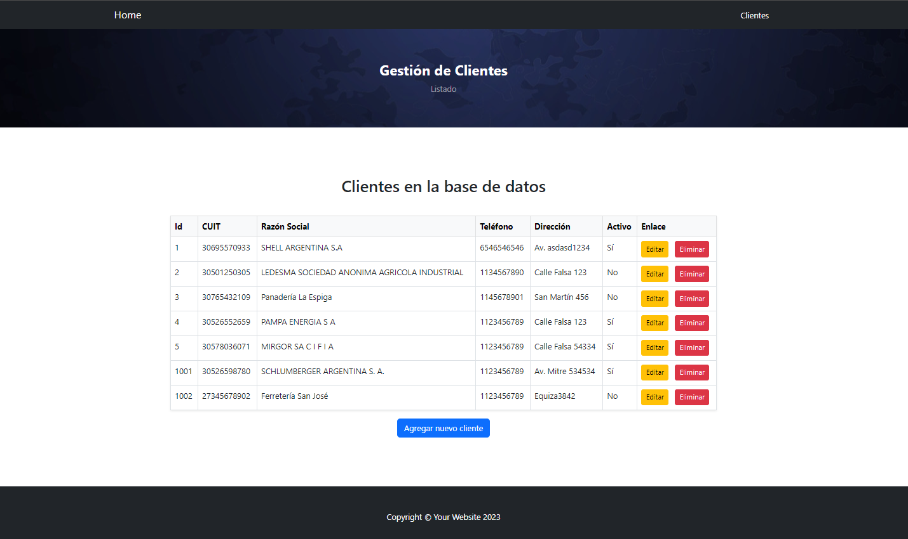
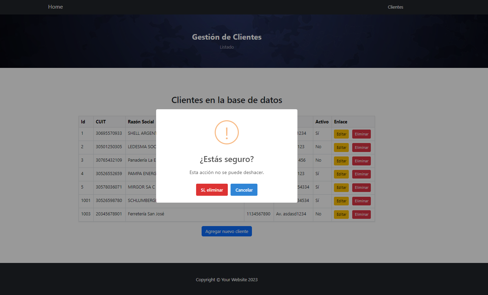

# 🧾 CRUD de Clientes - ASP.NET MVC (.NET C#)

Este proyecto consiste en un sitio web CRUD desarrollado en **ASP.NET MVC con C#**. Permite gestionar clientes mediante operaciones de alta, visualización, edición y eliminación.

---

## 📌 Funcionalidades requeridas

La aplicación permite:

### ➕ Dar de alta clientes
- **CUIT**: campo obligatorio de 11 dígitos numéricos (sin guiones).
- **Razón Social**: se completa automáticamente si encuentra el CUIT en la api de IntegraComex. 
- **Teléfono**: string de 10 dígitos, solo numeros y que no empiece con 0.
- **Dirección**: máximo 200 caracteres.
- **Activo**: checkbox (Sí/No).

### 📋 Listar clientes
Visualización de todos los clientes registrados, con tabla y acciones para modificar o eliminar.

### ✏️ Editar cliente
Modificación de los datos existentes con validaciones. Incluye confirmacion con SweetAlert.

### ❌ Eliminar cliente
Eliminación directa con confirmacion de SweetAlert.

---

## 📸 Capturas de pantalla

### Formulario de alta


### Listado de clientes


### Confirmación para eliminar


---

## ⚙️ Tecnologías utilizadas

- **.NET 8.0**
- **ASP.NET MVC**
- **Entity Framework 9.0.6**
- **Microsoft SQL Server**
- **Razor Views**
- **Plantilla de Bootstrap 5**
- **SweetAlert2** para las confirmaciones

---

## 🚀 Instrucciones para correr el proyecto

1. **Clonar** el repositorio:
   ```bash
   git clone https://github.com/alexander5109/ProyectoIntegraComex.git
   ```

2. **Asegurarse** de tener SQL Server en ejecución  
   Puede ser una instancia estándar.

3. **Editar** el archivo `appsettings.json`
   Asegurarse de que la cadena de conexión apunte a la instancia de SQL Server:
   ```json
   "ConnectionStrings": {
       "DefaultConnection": "Data Source=TU_EQUIPO\\SQLEXPRESS;Initial Catalog=IntegraComexDB;Integrated Security=True;Pooling=False;Encrypt=True;Trust Server Certificate=True"
   }
   ```
   Cambiar `TU_EQUIPO` por el nombre real del equipo o servidor.

4. **Abrir el proyecto**
   Abrir con Visual Studio el archivo de "ProyectoComex.sln"
   
5. **Ejecutar** las migraciones de base de datos  
   Abrir la **Consola del Administrador de Paquetes NuGet** y correr:

   ```powershell
   Update-Database
   ```
   Esto creará la base de datos, las tablas necesarias y además realizará un par de inserts de Clientes.

6. **Compilar y ejecutar** el proyecto  
   - Presionar `Ctrl + Shift + B` para compilar.  
   - Abrir Ejecutar con `Ctrl + F5` para abrir sin depuración, o `F5` para modo debug.